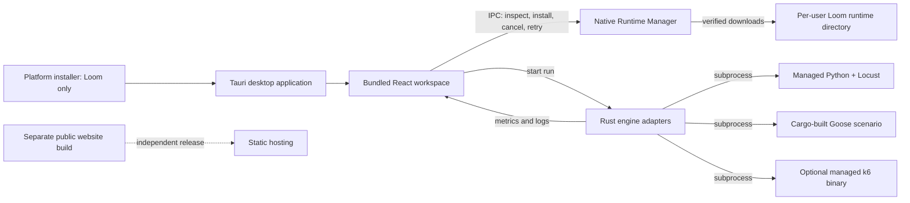

# Loom Runtime Manager Design

## Status

Approved in chat on 2026-09-27. This document defines the first project in the
runtime and public-site split: installing and managing local load-test runtimes
for the native Loom desktop app.

## Purpose

After installing Loom and accepting its terms on first launch, users should be
able to install the runtimes needed to create projects, run Locust, Goose, and
k6 scenarios, and inspect results without manually downloading tools or editing
shell configuration. Loom remains a native desktop app. Its React interface is
bundled inside the Tauri app and is not a hosted web application.

The public product website is a separate follow-on project with a separate
build and release. Docker-based self-hosting is also a later project: the current
container is only an engine environment and does not expose a Loom API.

## User flow

1. The user installs and launches the native Loom desktop app.
2. The first-run wizard presents Loom's terms and responsible-use agreement.
3. After acceptance, the Runtime Manager presents Locust and Goose selected by
   default. k6 is shown as an optional plugin with its AGPL-3.0 license and a
   separate unchecked consent control.
4. The user starts setup. Loom downloads the selected upstream tools into a
   Loom-managed, per-user runtime directory, validates each artifact, and
   installs dependencies without requesting administrator privileges.
5. A progress view reports the current tool, download/install stages, and
   recoverable errors. Users can retry failed components or cancel setup.
6. Loom verifies the installed commands and versions, then opens the desktop
   workspace. If a component was skipped or failed, the app continues with
   available engines and offers setup again from Engine settings.

The installer package contains the Loom application and required desktop
framework files. It does not contain Python, Locust, Rust, Goose, or k6 engine
binaries. Runtimes are acquired after first launch from their upstream sources.

## Runtime ownership and invocation

All managed files live below Tauri's per-user application data directory, in a
versioned `runtimes/` subtree. Runtime installation does not modify machine-wide
files, registry keys, shell startup files, or the global PATH. Loom resolves
managed executable paths directly and supplies a scoped child-process
environment when launching an engine. A user can continue to use an existing
system-installed engine; Loom's managed runtime is preferred when provisioned.

| Engine | Managed components | Run boundary |
| --- | --- | --- |
| Locust | Isolated Python runtime and virtual environment containing Locust | Loom launches the environment's Locust executable as a subprocess |
| Goose | Rust stable toolchain, Cargo cache, and generated scenario project dependencies | Cargo builds and runs the scenario as a subprocess separate from Loom |
| k6 | Optional upstream k6 release binary for the current OS and architecture | Loom launches the separately acquired k6 executable as a subprocess |

The Goose source file remains user-authored. Loom generates or prepares a Cargo
project around that source, resolves Goose through Cargo, and does not link
Goose into the Loom executable.

## Acquisition, consent, and licensing

- Locust and its Python runtime are acquired from pinned, documented upstream
  releases into a Loom-owned isolated environment.
- Rust is acquired through the official rustup distribution and installed into
  Loom-managed per-user Rust and Cargo homes. Cargo downloads Goose dependencies
  while preparing a Goose scenario.
- k6 is never embedded in the Loom installer or Loom executable. If the user
  selects k6 and accepts the separate AGPL-3.0 notice, Loom fetches the matching
  platform release from Grafana's official release source. Loom records the
  installed version and links to the license and source.
- Every downloaded archive uses HTTPS and is checked against a pinned version
  and upstream-published checksum before extraction or execution. A missing or
  mismatched checksum fails closed with an actionable retry/error message.
- The package manifest records supported versions, platform/architecture
  artifacts, checksums, upstream URLs, and license metadata. Updating the
  manifest is a reviewed source change.
- `LICENSES.md`, Engine settings, and first-run copy must be updated to reflect
  the explicit user-initiated k6 acquisition flow. Existing statements that Loom
  never automatically downloads k6 must not remain contradictory. This is a
  product policy change: user consent precedes an upstream fetch, while Loom
  continues to ship no k6 binary.

## Cross-platform behavior

The first supported release targets Windows x64, macOS x64/arm64, and Linux
x64/arm64 where upstream artifacts are available. Platform/architecture is
detected by the native backend, not inferred from frontend strings. Unsupported
combinations produce a clear per-engine unavailable state while leaving other
engines usable.

The installer and Runtime Manager run at user scope. They do not require an
administrator password or mutate global PATH. Child-process environment
variables point to the managed Python, Cargo, and k6 binaries. Existing user
PATH binaries remain detectable as a fallback. A separate PATH integration
feature is out of scope for the first Runtime Manager release; Loom does not
need PATH mutation to run installed engines.

Network access is required for first-time runtime acquisition. If offline,
Loom opens normally, keeps projects and scripts available, reports runtimes as
not installed, and provides a retry action when connectivity returns. Existing
runtime files remain usable offline.

## Native and frontend architecture

The native Runtime Manager owns platform detection, artifact manifest
resolution, download/checksum/extraction, progress events, cancellation,
version state, and child-process environment construction. Tauri commands form
the IPC boundary. React renders setup state and sends explicit user actions;
it does not run installers through the webview shell plugin. Engine adapters
consume a runtime resolver so managed and user-installed executables follow
one discovery policy.

The desktop entry point stays configured as Tauri's `frontendDist`. The public
website receives a distinct Vite root/configuration and output directory so
website pages cannot replace the React workspace bundled into the desktop app.

## Error and recovery behavior

- A network error, unavailable release, checksum mismatch, extraction error,
  permission error, or failed runtime probe is isolated to the affected engine.
- The UI identifies the engine, failed stage, and concise cause, then offers
  retry. Errors do not erase projects, scripts, prior run history, or already
  installed runtimes.
- Cancellation stops active network/extraction work, cleans only the incomplete
  staging directory created by that attempt, and retains completed components.
- Installs stage into a temporary directory and become active only after
  checksum verification, extraction, and a successful version probe. Switching
  active runtime versions is atomic at the Loom metadata layer.
- Runtime metadata is versioned and stored under application data. Removing Loom
  does not silently remove the user's scenarios or project data. Runtime cleanup
  behavior is surfaced in the uninstaller and remains scoped to Loom-managed
  runtime directories.
- Setup can be resumed after application restart; completed components are not
  downloaded again unless missing, corrupt, or explicitly updated.

## Security and privacy

- Runtime acquisition is native code with a fixed upstream manifest; user input
  cannot provide arbitrary download URLs or executable paths.
- Archive paths are validated before extraction to prevent traversal outside
  the staging directory.
- Downloads and launched child processes use argument arrays, not shell command
  strings. The Runtime Manager never invokes an elevated shell.
- Artifact checksums are verified before extraction. Release metadata is pinned
  in the application source and updated through reviewed changes.
- Runtime installation sends no Loom telemetry. The app stores runtime versions
  and installation status locally.
- k6 consent is explicit and separate from Loom's EULA. License/source
  attribution is available before and after installation.

## Out of scope

- A hosted Loom web application or remote job execution API.
- Docker control-plane orchestration, multi-user access, or authentication.
- System-wide engine installation and global PATH changes.
- Arbitrary third-party runtime plugins or user-configurable download URLs.
- Installing project-specific Python or Rust dependencies beyond the engine's
  own documented runtime requirements.
- Cross-platform installer UI that runs before the native app launches; setup
  happens in the same post-acceptance desktop wizard on every platform.

## Acceptance criteria

1. A fresh per-user installation can accept terms and install Locust and Goose
   prerequisites from the first-run desktop wizard on supported Windows,
   macOS, and Linux targets without a manual download, terminal command, or
   administrator prompt.
2. k6 installation is optional, starts only after its separate license consent,
   and fetches a verified official upstream release; the Loom installer and
   executable contain no k6 binary.
3. Loom detects managed runtimes without global PATH changes and launches each
   engine only as a subprocess.
4. Progress, cancel, retry, offline, unsupported-platform, and per-engine
   failure states preserve access to the desktop app and completed installs.
5. Existing system runtimes continue to work when no managed runtime is
   installed.
6. Runtime metadata and package manifests identify tool versions, OS/CPU target,
   source URL, checksum, and applicable license.
7. The desktop Tauri build uses only the desktop frontend output. A later public
   website build has its own entry point and artifact directory.
8. `LICENSES.md`, Engine settings, onboarding, installer/product docs, and CI
   release notes agree on k6's user-consented acquisition model.

## Evidence and upstream references

- Tauri desktop bundles are platform-specific and can use installer hooks, but
  the shared first-run wizard is the cross-platform setup surface:
  https://v2.tauri.app/distribute/
- Goose scenarios are Cargo applications, and Goose recommends release-mode
  builds for load tests:
  https://book.goose.rs/getting-started/creating.html
  https://book.goose.rs/getting-started/running.html
- Locust supports installation from PyPI with pip:
  https://docs.locust.io/en/2.32.4/installation.html
- Grafana publishes platform-specific k6 packages and standalone binaries:
  https://grafana.com/docs/k6/latest/set-up/install-k6/
